# Telecom X - Parte 2

Este projeto tem como objetivo identificar os principais fatores que influenciam o cancelamento de clientes na empresa **Telecom X**. A partir de dados históricos, foram aplicadas técnicas de análise exploratória, pré-processamento e modelos de machine learning para prever a evasão de clientes e auxiliar na tomada de decisões estratégicas.

## 🧠 Problema

A Telecom X apresenta um alto índice de cancelamentos. Este estudo visa compreender os motivos por trás dessa evasão e sugerir ações baseadas em dados para reduzir esse número.

---

## 📊 Etapas do Projeto

1. **Importação e limpeza dos dados**
   - Carregamento do dataset
   - Verificação de valores nulos e tratamento

2. **Análise Exploratória (EDA)**
   - Distribuição de variáveis
   - Correlações entre variáveis
   - Análise de clientes que cancelaram vs. os que permaneceram

### Distribuição de Evasões (Dados Desbalanceado)
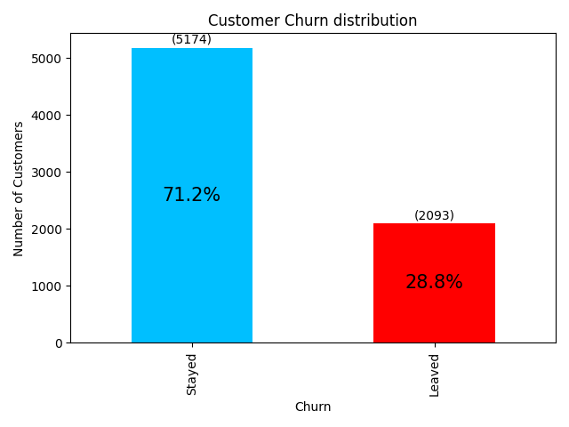

### Tempo de permanência × Evasão
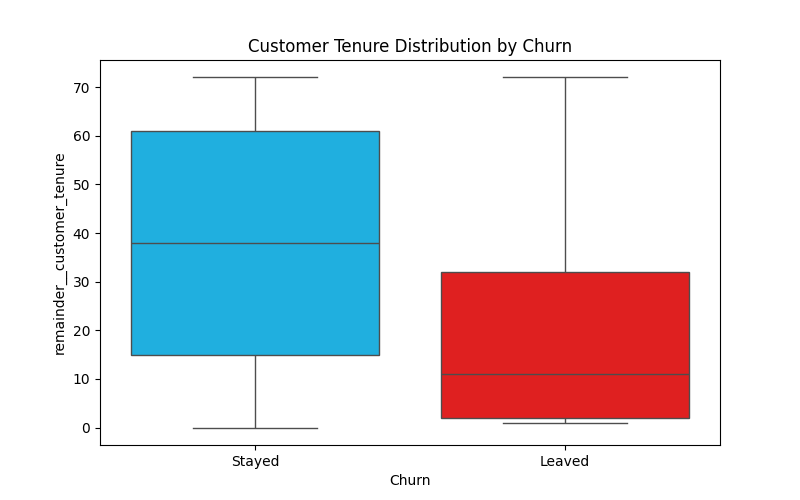
### Total gasto × Evasão
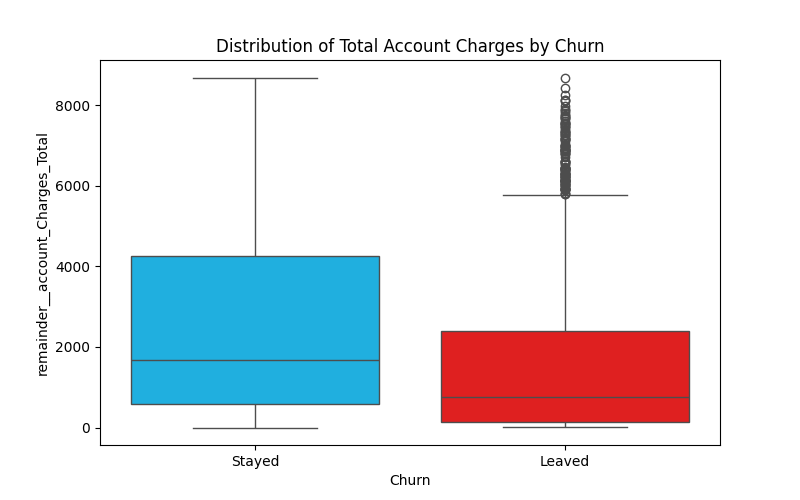
### Dispersão de Evasão por Tempo de permanência e Total gasto
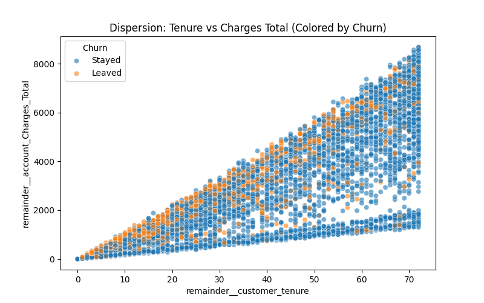

### Matriz de Correlação
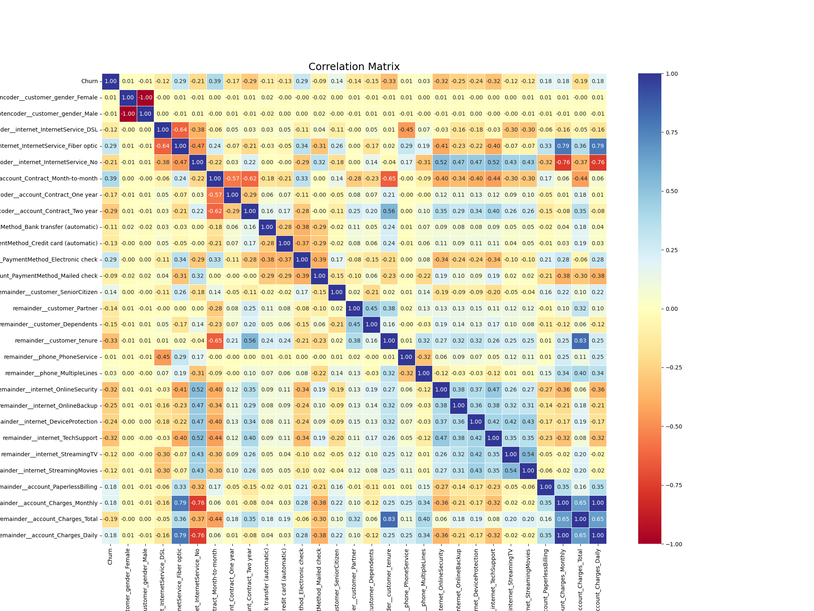
### Correlação com Evasão (Grafico em Barra)
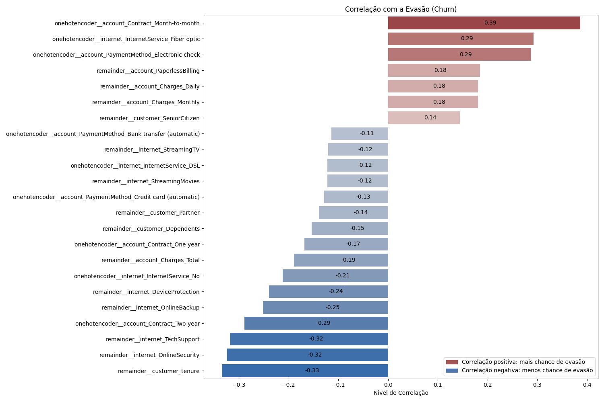

3. **Pré-processamento**
   - Codificação de variáveis categóricas
   - Normalização de dados (apeas para KNN,Regressão Logística)
   - Balanceamento da base (SMOTE)
Como visto na distribuição de evasão, os dados estão desbalanceados. Para melhorar o desempenho do modelo, apliquei a técnica de balanceamento oversampling **SMOTE**.
### Decision Tree PLOT
### Sem Balanceamento [3298,1334] x Com Balanceamento [3298,3298]

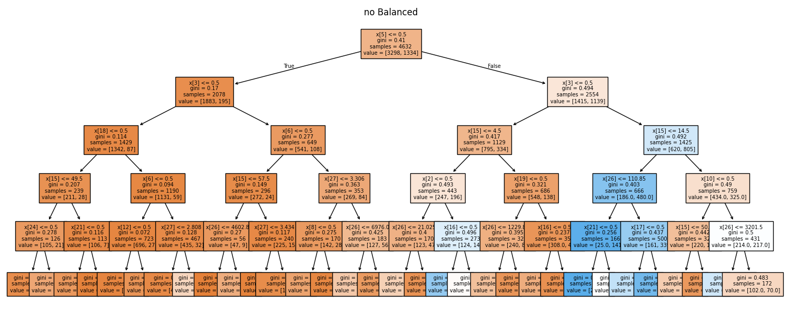
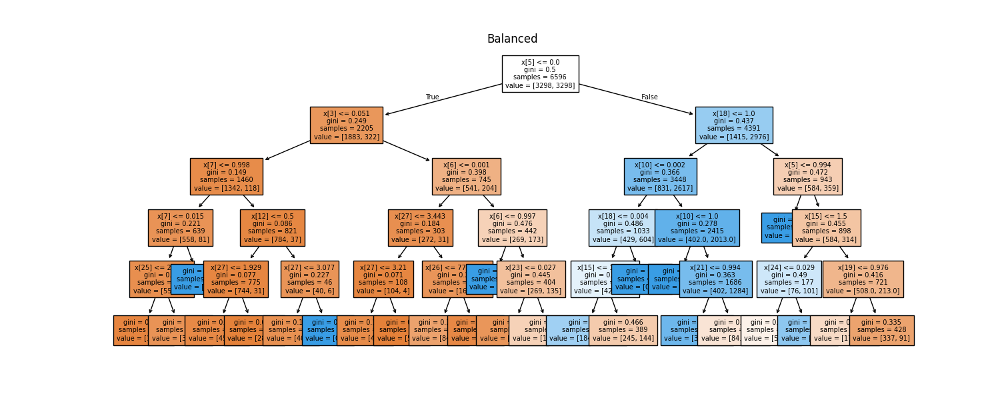

4. **Modelagem**
   - Algoritmos utilizados:
     - Decision Tree
     - Random Forest
     - Regressão Logística
     - KNN
   - Avaliação das métricas:
     - Acurácia
     - Precisão
     - Recall
     - F1-score
5. **Visualizações**
   - Gráficos comparativos das métricas
   - Matriz de confusão
### Modelo 1 - Decision Tree
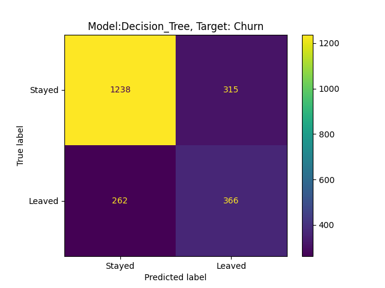
#### Score
- Treino: 0.80%
- Teste: 0.75%
### Modelo 2 - Random Forest
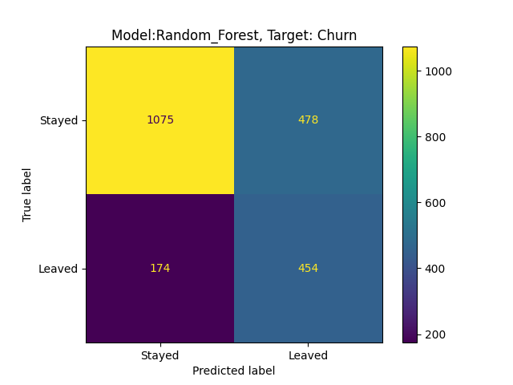
#### Score
- Treino: 0.83%
- Teste: 0.74%
### Modelo 3 - Regressão Logística

#### Score
- Treino: 0.59%
- Teste: 0.74%

### Modelo 4 - KNN
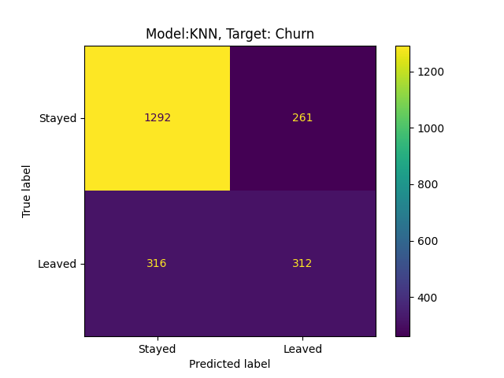
#### Score
- Treino: 0.50%
- Teste: 0.71%

### Comparação de Modelos
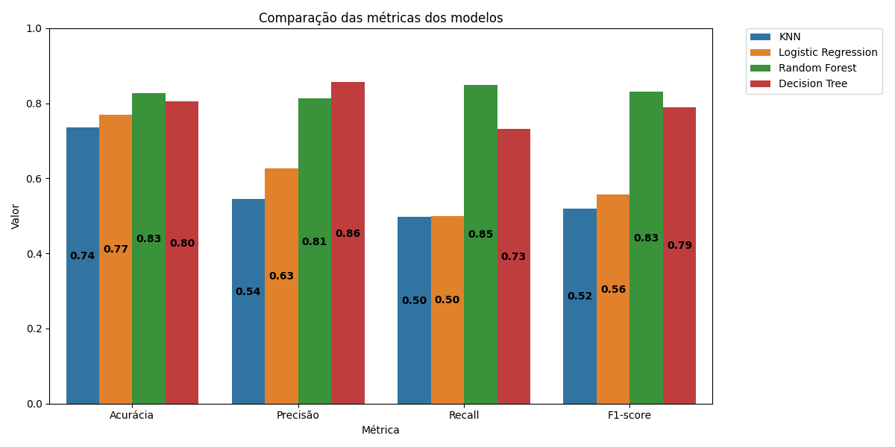

## Variaveis impactantes por cada Modelo 
### Regressão Logística

### Decision Tree

### Random Forest

6. **Conclusões**
   - O modelo com melhor desempenho foi o **Random Forest**, destacando-se pela F1-score.
   - As variáveis com maior impacto na previsão do cancelamento foram:
     - Tipo de contrato
     - Utilização de serviços adicionais
     - Tempo de permanência

---

## 📌 Principais Insights

- Contratos mensais possuem maior taxa de cancelamento.
- Clientes sem serviços adicionais tendem a cancelar mais.
- A fidelização aumenta com o tempo de permanência.

---

